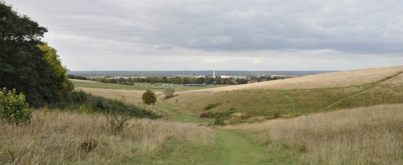
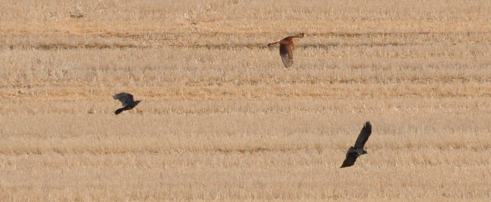

### Royston Rarity

A couple of fallow weeks follow. Birdguides is almost dead to me at
this point; new ticks are almost entirely more than four hours away
from London. Only one bird feels in range - a juvenile Pallid Harrier
is apparently hanging about on Therfield Heath. 

Pronoun guidance: BirdGuides is dead to AB1. This post covers the events of
September 30th, 2018

#### Logistics

Getting to Therfield Heath looks doable - train to Royston, and then ~40
minutes of walk. I've been in two minds about trying this all week - it'll
end up being at least two hours each way (trains are infrequent) and this has
all the hallmarks of a dip. The frequency of sightings during the previous
days and a very empty looking Sunday plan are enough to get me out of the door.

#### Surprisingly good ~~cakes~~ patch

Therfield Heath is an open space South-West of Royston. It harbours a
golf course and a rugby club, but still has some good rough patches
that look like they could support some wildlife. Within a couple of
minutes of reaching the heath, I'm four raptors up - Kestrel,
Sparrowhawk, Buzzard and Red Kite. Perhaps I've underestimated how
good a patch this is!

The heathland lies on the Northern side of a small hillock. The
reports I've got lead to the top of this hillock, where the heath
gives way to farmland. I accost a couple of locals for directions,
they reassure me I'm on the right track.

<figure class="figure">
  
  <figcaption class="figure-caption text-center">
    A view of Royston from the hill.
  </figcaption>
</figure>

The boundary between the heath and the farmland is a decently dense
treeline, and it's full of littlies, including some very confiding
Chiffchaffs. The farmland shows deliberate signs of someone having
thought about something other than crop yield; indeed, it seems like
some of this area is managed for wildlife primarily. Judging by my
experience so far, it's working a treat.

I hang about at the top with another birder for quarter of an hour. We
agree this is where we need to be, but there is no sign of the
Pallid. We go our separate ways (West for him, South for me) to
continue the search.

I've chosen better - not 200m down the footpath there are four chaps
with scopes hanging out. I beat a swift retreat to collect my previous
companion but he has managed to disappear - unless he's sprinted off,
he must have taken a different path to the one I explored.

This turns out to be a mistake - I arrive at this group and I've
apparently missed the Pallid by a couple of minutes. Typical. I get
the full lowdown from the group; apparently the bird has been doing
circuits of the area, but has frequently alighted on a perch point at
the border of this field and the next.

#### Oh no, it's a twitch!

Much hanging about follows. Definitely a twitch. I'm glad, at this
point, that 200 was the goal. Something higher would need
substantially more outings of this nature, and they really aren't my
bag. I'm not patient enough; I like a good walk or cycle (or even a
drive) punctuated by wildlife, not a trek to a specific point followed
by a lot of uncertain waiting about.

The sun goes in and out a lot; this is pretty handy, temperature
wise. Less good for scanning the horizon, which needs doing - plenty
of Red Kites and Buzzards need to be ruled 'not Pallid', which we do
successfully.

During these scans, the Pallid has managed to sneak back on to its
previous perch without any of us noticing. Hilarious. The ridiculous
unmistakable orange is in evidence despite the average light. The bird
doesn't look entirely comfortable - one leg looks a bit mangled. Oh
dear. Eventually it decides to have a decent fly around and we're
treated to some views that are borderline generous. If, still,
slightly too far away for the camera I have with me. The bird then
buggers off South and goes out of view behind the trees that shelter
the footpath that heads that way.

I decide to attempt to follow it. Entirely unsuccessfully, despite
some intrepid scrambling through brambles, and scaring the living
daylights out of a deer. Another birder approaches; he mentions that
they often get Merlin on the ridge further down the path.

I doubt it. My birding experience has led me to believe the existence
of Merlin as a bird is about as mythical as the equivalent wizard;
I've been to several places where they're supposedly common (or, if
not common, seen most days) and they have been utterly absent. What I
can tell is that the Pallid must have turned about, as this chap
hasn't come across it.

The choice between mythical Merlin and now slightly better
triangulated Pallid is an easy one, I turn around and head back up to
the hill. The scope gang are still all present and correct. No sign of
the Pallid. I have a look around and find a Kestrel taking a break on
a telegraph wire. Somewhere nearby, a Yellowhammer tells repeatedly of
its desire for a diminutive cheese sandwich. This is a decent patch!
Lucky Royston.

#### Pallid vs Corvids

The Pallid returns to great acclaim. This time it lands in a well
furrowed field that we have yet to stare at. Everyone files over to
stare at it. A couple of crows hang around nearby to add some possible
drama.

On the ground though, the birds seem to have collective blindness. The
Pallid hops past the crows within a couple of metres and no reaction
occurs. A similar nonaggression pact has obviously been agreed with a
Black-headed Gull (ok, a Larus, fine), whose expression could not be more aloof.

Confounding our claims that it must have some food on the ground, the
Pallid takes off empty handed. This seems to break the terms of the
agreement with the crows, who are immediately in pursuit. The Pallid's
escape is great to watch, a few languid flaps and carves take it
easily away from the busy crows, its bright colours now clear in the
afternoon sunshine.

<figure class="figure">
  
  <figcaption class="figure-caption text-center">
    300mm was not enough.
  </figcaption>
</figure>

We follow its progress as it summits the treeline,
quarters another nearby field, hops back over the trees and then
disappears off to the East. 

Cracking bird. Job done. Time to head home; I bid a cheery farewell to the
scope crew and set off back for the station, where I will inevitably have
just missed a train.