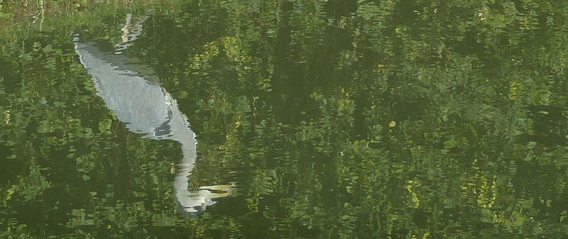

### Spotted: Crake

Another weekend rolls around. Spotted Crake fever is still in full
flow. 

Pronoun guidance: AB1 foolishly leaves the scope at home. This post covers
the events of October 7th, 2018.

#### Spotted: Crakes

BirdGuides is _awash_ with Crakes during the week, although the Willen Lake
bird, in Milton Keynes, appears to have moved on. If we're interested, we'll
have to make our way to Wilstone reservoir, in the productive birding county
 of Hertfordshire.

To my chagrin, this looks like a walk up and then back down the
wildlife black hole that is the Grand Union Canal. At least for Ring
Ouzel the outbound half was the Ridgeway, and the canal formed part of
a circuit. October is once again feeling very summery; perhaps a
picnic in the sunshine will make up for the dreary route.

I make a bold choice to abandon the scope in favour of lighter
equipment (and more food/water). This turns out well to start with -
it is _remarkably_ hot, and both AB2 and I shed multiple layers into
a backpack that just wouldn't fit into the scope bag.

#### Spotty at best: Nature in the canal

The canal is, typically, bereft of interest. A couple of coots panic at
the sign of humans. A small flock of finches makes an appearance where
the towpath switches sides at a lovely old bridge. The Grand Junction Arms
reeks deliciously of chips, and we only just manage to not stop there.

At this point the tree cover of the canal withdraws. The amount of
wildlife doesn't change much, but there is at least a horizon to scan,
which yields a couple of Red Kites. A friendly Grey Heron poses for some
photographs. We reach Tring Reservoirs Nature Reserve and things get
even better - tons of wildfowl, albeit not much of it particularly
interesting, despite some strong staring at. Warnings of Blue-green algae (we
struggle to calibrate our fear meters) are pockmarked around any paths down
to the water's edge.

<figure class="figure">
  
  <figcaption class="figure-caption text-center">
    Reflection of a Heron.
  </figcaption>
</figure>

We cross the causeway between the two main reservoirs, risk life and
limb crossing Tringford road, then set up for a picnic alongside the
last branch of reservoir. It's suitably tranquil, but a bit insect
ridden. We wonder out loud whether it is safe for us to eat sandwiches
in a blue-green algae area. This discussion lasts as long as it takes
us to realise we are too hungry to care.

We're not far away now - just a couple of road sections and a short
track across a field, and we'll be at Wilstone reservoir's Cemetery
Corner, where our Crake has been spotted. The soundtrack, in my head,
immediately switches to Pantera's "Cemetery Gates".

#### Spotted: Birders

We walk North-West along the reservoir's North-East side (the
reservoir is a rhombus with N/E/S/W corners). Conditions are not
ideal. The reedbed, which stretches from the Eastern corner, is almost
due South from where we are; the sun is in the South-West. A recipe
for sore eyes. In addition, a firm breeze is blowing from the North,
which, when the sun goes in, reduces the temperature to somewhere
below pleasant. Worst of all, only two birders other than us are
present, and they haven't seen anything.

Patience is going to be required. Goddamnit, it's another bloody
twitch! And, frankly, leaving the telescope behind has now proven to
be an idiotic decision; if I had to classify the difficulty of finding
this bird, it's beyond even finding Jack Snipe from the tower hide
at Barnes WWT.

Our little group quickly starts to swell and soon we hit double
figures, and we're up to four scopes, two of which are _serious_
Swarovski affairs. Both AB2 and I persist with binoculars; I try
various poses (sitting on the reservoir embankment's edge, lying
completely prone, a one knee flat yoga position that shall remain
nameless (unkempt donkey?)) to lessen the effects of the wind and the
light.

#### Spotted: Jack Snipe

One chap intermittently makes excited noises for three or four
minutes. Everyone is too polite to enquire as to why, but tries to
decipher the source from his directions. Now, directing folks along a
reedbed edge is not simple, but this man has a talent for total
opacity. He could be describing almost any five metre stretch of it
from the level of detail we're getting. "Behind that Black-headed
Gull, and then left, behind a Coot". Well, yes, great. There are ten
to a hundred of both of those species floating around. Could you try a
different landmark, perhaps?

We eventually discover he has found not Spotted Crake but Jack Snipe -
worth a look for sheer scarcity purposes, but not a tick (it's been on
the list since the end of March). The group gets back to the serious
work of finding the Crake. Much chat circulates about its size and
identifying characteristics. A buff tail is about the only thing
everyone can agree on.

#### Weather: Spots of sunshine

AB2, remarkably, is enjoying this experience immensely. I suspect
some of the enjoyment may have come from observing my transformation
into full-on twitch mode. Humph. It could also be the weather: the
interrupted sunshine means her instant-burn complexion is safe without
continuous application of sunscreen, and it's neither too warm or too
cold.

#### Spotted: Crake

A further half hour or so of staring passes, and then a different
person starts to get excited. Their directions are _much_ better, and
before I know it I catch the most fleeting glimpse of a buff tail I
expect I will ever encounter, as the crake scurries back into the
reedbed having spent a precious moment or two visible on the edge.

Wow. That's a lot of work for not a lot of bird. We hang about a
bit in the hope of seeing a bit more, and eventually the bird improves
from 'elusive' to 'showing abysmally', making a few scurries along
the front of the reed bed, and offering occasional occluded views a foot or two
within it. One of the better equipped scopes is generously leant out for
general use and that improves things, but I still come away with
little lasting impression other than that brief buff flourish.

We debate the relative pros and cons of walking back versus ordering a
taxi (a very short conversation bookended by an proudly covert wee
near the car park). Before too long we're on the train home, not quite
victorious, but successful, at least.