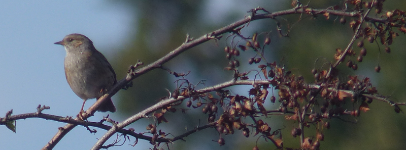
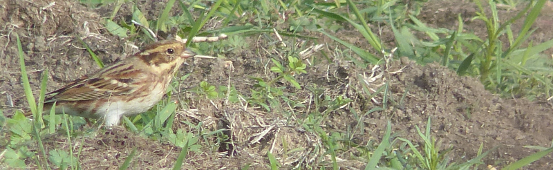

### Rustic Bunting

Two further weeks pass; trips to fall migration hotspots are turned
down in favour of a quiet life; again I am grateful to have picked
(and reached!) 200 already. A nearby twitch beckons, though - [the gang
over at Wanstead](https://twitter.com/WansteadBirding) have found a Rustic Bunting, and that's really too
near to ignore.

#### Nearby, but not that near.

Of course, too near doesn't necessarily mean too convenient - Wanstead
is three or four public transport hops from Golders, but I've a decent
book on the go so this is no great hardship. I do like the flats;
there's something quite brilliant about such a forsaken feeling place
(there's _always_ a burnt out car somewhere on the flats - where do
they come from?) being so well birded, and yet also being so heavily
used (visit on a weekend and BE AMAZED by the amount of football
occurring).

I stumble out of a train in Leytonstone and walk, very determinedly,
towards the flats; there's enthusiasm in them there legs. I veritably
stomp my way across the two sections of the park that I have deemed
unlikely to contain a Rustic Bunting (by cunningly asking someone who
looked more birdy than footbally; top radar, that).

#### Three's a crowd, and there's maybe a hundred birders here

There are _crowds_ of people on the edge of where the bird has
previously been seen - easily fifty plus, with more arriving by the
minute. This is a bit weird. There is a lot of WhatsApp happening
between folks who have split into separate groups to encircle the area
of trees the bird's been seen in.

I make my way around to where the last sighting was - lots of hopeful
folks with scopes hanging around. There's some movement in the bushes
nearby, with a bird or two dropping out of cover to poke around on the
ground. This is definitely bunting behaviour, but the bunting in
question is Reed, and, on one occasion, Dunnock (i.e not a
bunting). There are claims of sightings from a few folks ("It's on a
twig just behind that leaaargh it went down again sorry" variety) but
not a lot else. Much jostling for position - this is like being at a
gig. AB2 would _detest_ this; she has done well to bail.

I spend a bit of time fiddling with a camera. Separating Rustic from
Reed is not a task I expect to be up to on my own, so I want some
documentary evidence that I can review later for confirmation. I take
a couple of test shots of a Dunnock (perching very beautifully at the
summit of a nearby bush) and am pleased with the results - the bridge
camera has a phenomenal zoom, but can have trouble if the light isn't
perfect, having set it up for what seems to be average light
conditions I should at least have a chance.

<figure class="figure">
  
  <figcaption class="figure-caption text-center">
    A good test shot of a Dunnock.
  </figcaption>
</figure>

#### Rustic Bunting?

A sudden tide in the crowd picks up, and we're off, circling around
the enclosure in a clockwise direction. This bird better like an
audience! We've perhaps traversed pi/2 radians around when we come to
a barrage of birders that's already two deep and twenty wide. We
surround them, widening and deepening the twitch. Between two pairs of
shoulders I can just about make out a bird foraging on the ground. Is
that it?

Thankfully there is commentary being provided: "It really likes this
area; I think someone put down food for it"; "There is just a hint of
pink in the bill, no?"; "That's definitely it then? Yep, that's
it". Ok then; I'd best try to convince myself I can tell the
difference.

#### Rustic Bunting

A long couple of minutes follow. Some absolute oik decides to stand
about a foot in front of me. There is limited etiquette in twitching,
but if you move into a position and I can lick the back of your head,
I think we can both agree that you're not thinking about your
surroundings. I wait for them to fidget, and manage a few decent
frames of the suspected Rustic in the camera before suddenly it's off,
up over our heads and towards the broom field behind us. And so is the
twitch, walking/jogging/proceeding in its wake, a crocodile of optic
laden anoraks. These are my people.

The bird alights in the top of a young oak tree. It _does_ like an
audience after all; such a pose can only be deliberate. The fans go
wild; the air is filled with the roar of shutter clicks, oohs, aahs,
"are we sure that's it? Yes, yes". It's all I can do to not collapse
in a fit of giggles. After completing this part of its display, the
bird promptly sods off back towards the enclosure and disappears. The
twitch dissapates, reverting to its state as I found it - several
collections of lost looking individuals glaring at trees.

<figure class="figure">
  
  <figcaption class="figure-caption text-center">
    Rustic colour less clear here, but pink culmen? Tick.
  </figcaption>
</figure>

I return home to view my photographs on a reasonably sized
screen. There are, miraculously, signs of the diagnostics the bird
book suggests - a lovely red brown (rustic, even) patch on the nape,
the hint of pink in the beak. Definitely enough for a tick; and what
an experience to be in such a big group!