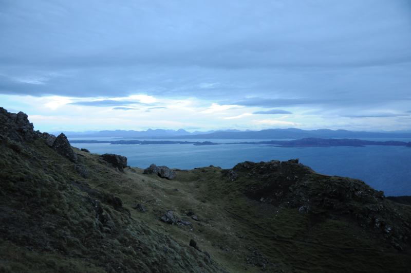

### Skye

A hastily arranged week in Scotland suddenly looms in the
calendar. After much negotiation, we're going to spend much of it on
Skye.

Pronoun guidance: AB1 negotiated poorly. This post covers the events of
November 23-30 2018.

#### Grumble

I'm not overly thrilled with this choice; bird wise, I'd rather be
operating out of somewhere nearer Inverness; there's a wider range of
well known good spots. Skye, I suspect, will be bleak, big, and mostly
blank of birds. Still, there's a couple of decent walks, and it'll be
by the sea.

#### Getting there

After a luxurious trip on the sleeper up to Inverness, it's a long
(but tremendously scenic) drive over the mainland to Skye. We stop at
[Carron Restaurant](https://www.tripadvisor.co.uk/Restaurant_Review-g1463472-d1536386-Reviews-Carron_Restaurant-Strathcarron_Scottish_Highlands_Scotland.html)
- which, if you even drive this route, you should too, the food and
service is excellent (the puzzling placemats are the cherry on
top). Apologies for the TripAdvisor link, at pixel time, the [official website](http://www.carronrestaurant.com)
is only a "leave your email here so we can tell you when we reopen" form.

We're staying in Broadford, by the bay. This turns out to be a very
good decision; our cottage has an excellent view out over the sea, and
decent enough windows that I can scope from an armchair. Luxury!

<figure class="figure">
    
    <figcaption class="figure-caption text-center">
        This is the life!
    </figcaption>
</figure>

I am soon wishing I had a slightly chunkier telescope. The sea is
big. Some of it is very far away; and of course there are several
birds bobbing about on the boundary between "comfortably identifiable"
and "anonymous blobs". There are obviously several divers, some grebes
and a few sea ducks out there, but I'm going to have to be patient and
wait for them to be closer to id them.

#### Day One

I don't have to wait too long. The morning after we arrive is bright
and still. Without too much difficulty, I pick out Slavonian Grebe,
Black-throated Diver and Common Scoter (which is mildly unusual for
the area). The shore holds obvious Curlew, Redshank and Oystercatcher,
and the garden Reed Bunting. None of those are ticks, but they're
excellent birds to have on your doorstep!

<figure class="figure">
    
    <figcaption class="figure-caption text-center">
        A Broadford Bay panorama.
    </figcaption>
</figure>

We spend much of the day exploring the island by car; not a great deal
more is observed - some other divers, plenty of cormorants, a few
waders here and there. No eagles!

<figure class="figure">
    
    <figcaption class="figure-caption text-center">
        A shy hoodie.
    </figcaption>
</figure>

#### Day Two: More challenging sea-creatures

Morning two has the same suspects, less the Scoter, but with a pair of
additional mysteries. Heh. This is a very good guide to why
seawatching is difficult; both birds spend only a limited time on the
surface, and can obviously move significantly under the water. To
compound this, the waves occlude the bird even when the bird is on the
surface, the light is mediocre, and they're bloody miles away. Oh, and
they're both on their own, with no nearby friends to help give them
some scale.

The first mystery is the easier one - an entirely monochrome bird,
that, after a few minutes of watching, has a thin, sharp beak, rather
than a duck's bill. There are hints of the white wing patch that will
identify this bird so easily in the Summer. Yes, it's black guillemot.

The second is a tougher challenge, not least because I think it's a
tick, and I want to be very sure. I end up taking the scope outside to
follow the bird around the bay to the left. This bird has the same
mottled palette as the Guillemot, with some additional brown, and much
patchier colouration, particularly on the head, which is more rounded,
and equipped with what is definitely a duck's bill.

By process of elimination (and extended periods of consultation with
the bird book), I think this can only be a female (or possibly
juvenile) Long-tailed Duck; the combination of features rules out
everything else. Right, it's going on the list.

The rest of the day isn't particularly birdy; some Ravens mobbing a
Buzzard are notable, we also see two or three groups of divers
(species not clear from the car) in the lochs that cut the island into
what I can't stop describing as lobes. Lobes.

#### Day Three - Scenery Day

Morning three, and there's a diver a bit closer in that looks
promising. There've been what I think have been Black-throated Divers
in the bay every morning so far, but this one is Great Northern, for
me; it has a more brutish profile, a giant wedge of a beak, and that
more beady looking eye that gives it a more primitive air than its
cousins. Yeah, that lumpy cliff of a forehead is a giveaway, GND it
is.

We hop in the car for a whistlestop tour of places we'd like to walk
around - it looks like this will be our last day of non-awful
weather. We make it up to Quiraing (joyfully pronounced "Kerrang" to
the sign of the horns \m/) and get righteously blown around for an
hour or so amongst some epic geology, flourescent coated sheep and
some Ravens. We're pretty confident we didn't manage the walk we set
out to (hard to see the map with eyes full of tears, thanks again
wind) but we get back to the car and discover we don't really mind.

<figure class="figure">
    
    <figcaption class="figure-caption text-center">
        Quiraing
    </figcaption>
</figure>
<figure class="figure">
    
    <figcaption class="figure-caption text-center">
        Quiraing
    </figcaption>
</figure>
<figure class="figure">
    
    <figcaption class="figure-caption text-center">
        Quiraing
    </figcaption>
</figure>
<figure class="figure">
    
    <figcaption class="figure-caption text-center">
        Quiraing
    </figcaption>
</figure>

Flying visits are made to An Corran (where we are dubious about the
dinosaur footprints, but there is a nice Grey Heron). Mealt falls is
underwhelming, but a good opportunity for a biscuit and a few terrible
photographs.

<figure class="figure">
    
    <figcaption class="figure-caption text-center">
        Mealt falls; yeah, alright.
    </figcaption>
</figure> 

A quick walk up to the Old Man of Storr, on the other
hand, is an excellent distraction.

<figure class="figure">
    
    <figcaption class="figure-caption text-center">
        Storr? Phwoar.
    </figcaption>
</figure> 

We gamble a bit on our ability to get up and down in under ninety
minutes (we get most of the way up in half an hour, the skies look
clear - what could possibly go wrong?) and it's worth it, the views
are spectacular. We make plenty of stops to look back down the hill
towards the mainland (and to discuss which particular sticky up rock
is actually the "Old Man"; we remain uncertain). Having the geography
protect you from the wind can really make a walk, it turns out.

<figure class="figure">
    
    <figcaption class="figure-caption text-center">
        Storr? Phwoar.
    </figcaption>
</figure> 

Once at the top (well, the foot of the cliffs that we decide is a
bridge too far), we start to circuit round a tall rock
formation. Perhaps two thirds of the way round, a giant raptor, mobbed
by a pair of Ravens, swoops over us from the cliffs above. Golden
Eagle? Probably; too big for Buzzard, not rectangular enough for
White-tailed. Not a good enough view to be confident though, and by
the time I've sprinted/stumbled out into the open again all three
birds have disappeared. Sod. I don't think we can count that.

<figure class="figure">
    
    <figcaption class="figure-caption text-center">
        Storr? Phwoar.
    </figcaption>
</figure> 

We spend a couple of minutes more taking in the view before agreeing
that it might be starting to get a bit dark for this. A hasty descent
is made, two covert wees are achieved and we're back on the road
home. As we leave Portree, the heavens open, and a journey back to
Broadford that usually takes an hour or so takes closer to two!

#### Rainy days

The rain doesn't really stop for the rest of our time on Skye. We make
an attempt to visit Neist Point lighthouse, but the wind and rain is
so strong that we don't get beyond the car park; the path to the
lighthouse itself is even more exposed, and we aren't entirely
convinced that getting saturated with cold Atlantic water is a price
worth paying for the same 50m of visibility a little bit further out
into the sea. We do spot a beautiful flock of Goosander on Loch
Harport on the way there, mind; the sun even comes out for a second or
two to help them show off their pink-tinged white tummies.

On our final day we make another attempt at finding an eagle; it's
time for a drive down Glenbrittle. Beyond some Oystercatchers at the
end of the Glen, however, it's a bit dead. 

<figure class="figure">
    
    <figcaption class="figure-caption text-center">
        View from end of Glenbrittle. Was it worth it? Yeah, just about.
    </figcaption>
</figure> 

We suspect all of the non-water based birds are sensibly sheltering somewhere
- all our hilltop staring comes to naught - not even a Raven deigns to
appear. And we're stopping to look at those tops even more than usual,
because the road in and out of the glen is windy enough to trigger my motion
sickness even when I'm drivin. That is seriously strong work. Oh well; only one
eagle out of two in 2018, it seems!