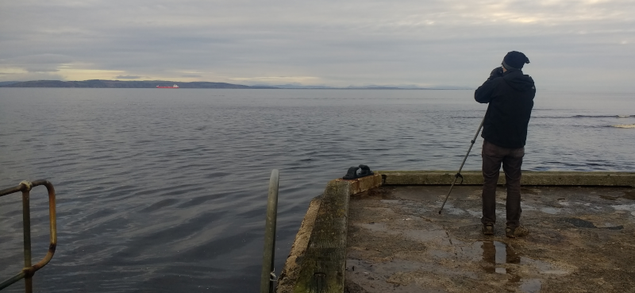
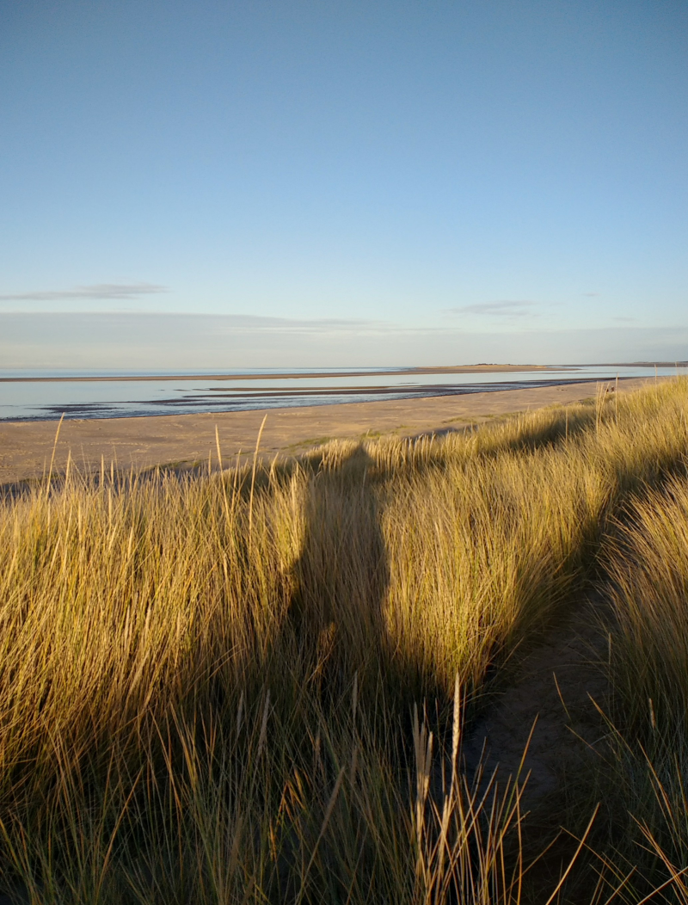

### East of Inverness

Time to switch coasts; we've got a night in Lossiemouth before a flight back
from Aberdeen.

Pronoun guidance: AB1 prefers this side of Scotland in the Winter. This post
covers the events of December 1-2, 2018.
 
#### Getting there

The drive back is just as good as the one out - we notice that a few hills
have a dusting of snow on them that didn't before. We make our traditional stop at
the large Tesco on the way out of Inverness (which I think is our strongest
repeat destination, coming in at over one visit per Scotland trip across
multiple years; well done to the proprietors) and head out for Nairn,
or, more specifically, for Culbin Sands.

#### Culbin Sands

Nairn is a most pleasant town. We have underestimated its loveliness
before, having only driven through it under a bit of a cloud last
time. It turns out that with a bit of sun and a bit more of an
explore, our impression quickly improves. We park up next to the
marina, and it's turned into a terrific afternoon, blue skies, calm
sea, gorgeous views over the sands. 

The birding, within a few seconds of getting out of the car, is also
excellent - loads of seaducks, a nice raft of scoters, some waders
along the water's edge. The best is probably a flock of fifteen or so
Long-tailed Duck, in much better light and at much better distance
than the single Broadford Bay bird. The difference in size and posture
between the male and the female is surprising - or perhaps it's just
the starkness of the plumage that gives that impression. A fabulous
duck in any case.

<figure class="figure">
    
    <figcaption class="figure-caption text-center">
        Tens of pixels in this image represent the distant duck rafts with great clarity.
    </figcaption>
</figure> 

We embark on a walk along the beach, as advised by Gordon. This is a
bit more like it; lots of low level activity, some nice greenery (a
forest off to the right), a bit of sun, the concept of being able to
get back to the car and not have to drive for another two hours to get
home. Bliss. We even manage to turn it into a circular walk, crossing
a bit of bog in order to come back along the forest's edge. The trees
tempt us in with occasional birdsong clamour, but it's getting dark,
and we're sceptical enough after a year to know what we can hear
is Siskin, Treecreeper and Goldcrest, and not the Crossbills or
Firecrest that would add to our list.

<figure class="figure">
    
    <figcaption class="figure-caption text-center">
        Culbin sands.
    </figcaption>
</figure>

Back to the car, and it's a short drive to Lossiemouth, where some
seriously cosy accommodation awaits. We're somewhat disappointed to
only be staying for a night!

#### Loch Spynie

We wake the next morning to continued calm weather. We go for a quick
tour of Lossiemouth; it's got a decent Co-op and a lovely seafront. It
also has good enough waves to tempt out surfers in early December (in
double wetsuits, we guess). As you'd expect, the River Lossie meets
the North Sea here, but it has a good kilometre or two of running
parallel to it, and it's full to the brim with wildfowl.

We have places to go, however; to the South, a hard-to-find reserve at
Loch Spynie offers a possibility of Red-necked Grebe, and maybe a
Glaucous Gull. Gordon's directions and a few actual road signs get us
to the reserve - the car park thankfully has an interpretive panel, or
you might think you had just arrived at a farm. It's a short walk from
there to the single hide, which is flanked on both sides by feeders,
and offers excellent views of a good three quarters of the lake.

The lake is full of lake ducks, i.e Tufted Duck. There are hundreds. A
few Goldeneye lurk here and there. A gentle trumpeting tells us there
are some Whooper Swans here too - a pair of them and at least one
juvenile. Of RNG there is no sign, however. There are many
Great-crested Grebes, which are a confusion species for basically
everything at this time of year. Each grebe is examined for signs of
once having a red neck, but all prove innocent. We probably miss some,
but they're differently shaped birds, and the scope gives us a good
enough view that we think we'd be able to spot RNG.

A local birder arrives, bringing with him the knowledge that our
pronunciation of both Lossiemouth and Spynie is hilariously
inaccurate. He can't find RNG either - apparently it has been towards
the areas of the Loch the hide doesn't overlook so well when it was
last seen. Typical. Some of the grebe-shaped blobs towards the far
left and right of the hide's field of view are brought back in for
questioning, but still, no joy. We bid our companion farewell and go
for a quick walk in the woods, but on discovering we're going to be
unable to circuit the Loch easily, we head back to the car sooner
rather than later.

#### Fochabers

Our next stop is Fochabers. A large gang of Waxwings has been sighted
here, and the description of their location is _very_ precise. We stop
on the designated road and stride out of the car, expected to be
greeted by the gentle trills of Waxwings. We are disappointed. We're
also, ridiculously, at 2pm, already starting to run out of daylight -
it's become overcast; the light is bad enough that we spend ages
discerning that the treetop birds nearby are all Redwings (we should
really have guessed from the behaviour - flitting to the next tree
further away as we approach is classic Winter thrush behaviour).

We take a stroll along the Burn of Fochabers, thinking that if we were
Waxwings, that's the sort of place we might hang out. This is, of
course, foolish - Waxwings love a supermarket car park more than they
do a wood - they'll go wherever they can find berries. We're somewhat
short of them here, the last we saw were in gardens nearer the
car. First though, a covert wee is urgently sought (and found), and
some much needed patience is restored. The path along the burn then
links us back up with the road on which we parked. We've probably
spent forty minutes walking one and a half kilometres. Ridiculous,
really.

Fifty Waxwings have vanished, then. No-one else has found them
elsewhere. We make a guess that perhaps they're still in Fochabers,
but not _exactly_ where they've been for the last two or three days;
earlier sightings have them elsewhere around the boundary of a school
lurking behind the treeline opposite where we've parked. A slow drive
around Fochabers follows - Waxwings don't tend to be shy, and there
are fifty of them; if we confine ourselves to the border of the
school, how hard can it be?

Well, if they aren't there, impossible. Our initial exploration around
the West side is fruitless - we see a single Blackbird and nothing
else, even the Redwings desert us. We circuit back round via our
original parking spot and try the East side. This is perhaps the
safest residential driving that has ever occurred in Fochabers - we
are doing all of 8mph. It pays off - we find a solitary Waxwing
perched in a tree on Woodside place. We try briefly to observe from
the car, but this isn't really a place we should park, so AB2 sneaks
out of the non-Waxwing side door and I glide the car away at a gentle
2 or 3mph. The Waxwing is unmoved. Phew.

I park up round the corner, and get back to the Waxwing to enjoy all
of twenty seconds view before it ups sticks, flying high over the
house of the garden it had perched in. Not the greatest Waxwing
encounter ever. I'm still rather spoilt by them turning up on some
bushes near work a few years back, where an area that previously had
only ever held starlings had ten or so Waxwings in for a couple of
days. We review the photos of this bird (universally awful) before
starting to make tracks to our final location of the week - the mouth
of the River Spey.

This turns out to be underwhelming - the Scottish Dolphin Centre isn't
open, and the light levels are so bad that even the brightness of a
few nearby Goosander aren't enough to tempt us out of the car (and
into the cold) for very long. We eat some sandwiches in a huff and
decide that this trip's birding is done, and the slightly arduous
journey home should now be started.