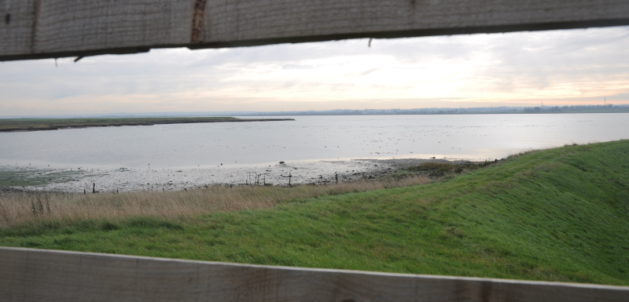

### Nottinghamshire Excursions

The end of the year is rushing towards us and I have more vacation
than I can carry over. A couple of days off to see the madre (and
drive her to see a few year ticks of her own), then.

Pronoun guidance: AB1's Mum. This post details the events of December 13-14,
2018. N.B Thumbnail Goosander are a very blurry shot from Abberton in 2020.

#### Hoveringham pits

Mum has exhausted Attenborough's birds for the year, so we need to go
a little further afield. Our first stop is East of Nottingham, on the
North bank of the Trent. Hoveringham is its name.

I haven't been here before; my Trent valley exploration has always
been up the river from Toton, not down. It's even more of an obvious
flood plain here than there - my brain's "flood risk" alarm is going
off constantly; I wonder how this area isn't semi-submerged every
other year (I think there's some equipment to stop it somewhere).

Our stop is at a sailing club of the sort that don't want any
non-members using the road down to the club, according to some very
snotty signs. This is like a red rag to a bull for me, and after a
brief stop, we drive down it anyway, parking just before the gate
where you have to speak to someone to progress. I suspect, in standard
U.K fashion, you can just rock up as a guest if you're polite,
particularly given how many folks seemed to be doing so, but why the
sign if so? Vexing.

We're here to find Black-necked Grebe; one's been reported
consistently throughout the week, and there's only one lake, so how
hard can it be?

Well, after two failed attempts at Red-necked Grebe, we know the
answer to that. Particularly when the lake is bloody enormous and
there's a freezing cold wind. We take turns between the scope and
drying our faces of the floods of water streaming out of our eyes.

On this occasion, however, we are eventually successful. Mum finds the
bird near a set of buoys off towards the back. I worry that my
diagnostic for BNG is swiftly becoming "fluffier than the other
grebes", but after continued staring I can look back at the bird book
and go, "yeah, that's it". Staines Reservoirs, all is forgiven.

#### Clumber Park, for a Smew?

A quick stop for lunch is followed by a drive North to Clumber
Park. Coming here used to be a double edged sword as a kid - amazing
park (great bike trails, I vaguely remember. Or maybe that was
Rufford), but terrible journey to get there: guaranteed travel
sickness. Today, I'm driving and it's surprisingly smooth. I guess it
takes longer if you have to cross Nottingham.

We're here for a Smew that thinks it's a Goosander. Or perhaps it just
likes the company of Goosanders. Clumber Park has a giant long lake to
search, but thankfully the end we park at seems to be harbouring the
vast majority of the birds.

It's turned into quite a pleasant Winter's afternoon - a decent amount
of sunshine, and cold but not freezing. We set out on the path that
circuits the lake.

We quickly find our first Goosanders. The lake empties into a rivulet
at its Eastern extreme, which has a cute bridge over it. From the
bridge we can see ten or fifteen Goosanders messing about below. They
are brilliantly lit by the winter sun, but alas, there is no Smew
amongst them; what a fabulous view that would have been. It would also
be very un-Smew like, though; all the birds I've seen have been
skulkers, paddling around as far away from human eyes as possible.

We can see plenty of detergent-advert level white in the main lake
too, but we're hoping that, from a bit further round, the sun won't be
entirely in our eyes, and we might have a bit more hope.

There really are a _lot_ of Goosander here - two or three groups of up
to twenty. They're fast becoming duck of the year for me, an oft
unlooked for bit of treasure. A few Goldeneye are around as well,
adding to the distractions. What are we here for again? Oh yes, Smew
(female, "redhead"). I trust to the descriptions from [Notts. Birders Twitter](https://twitter.com/NottsBirders),
and stick mostly to birds near Goosander flocks. If only there weren't so many!

Just as we're about to give up, a bird surfaces from a dive in the
furthest group of Goosanders. Ah, now, even without being in the
scope, that's setting off all my "different to everything else here"
alarms. A rapid scope reconfiguration confirms; that's our bird! I
switch places with Mum, and she gets a good thirty seconds of Smew
before it psychically detects it is being viewed and flies off in a
huff. Jubilation!

We take a quick detour on the way home, as some Waxwings have been
spotted. We're too late though - there's nowhere to park, we're
starting to get caught in rush hour traffic, and it's too dark. Home
time!

#### Rutland Water

Tomorrow arrives and a plan to go to Rutland Water arrives with
it. There are a couple of birds there that are ticks for both of us,
and one of them even has reasonably succinct directions (searching the
whole lake is a Sisyphean task).

Yes, fine, this bit is not in Nottinghamshire. You win this round, pedants.

We park at the well known end of the reserve and are greeted by some
immensely enthusiastic volunteers. They've definitely had their
Weetabix. That, or they don't usually get many visitors on a Friday.

We have a quick look for the visitor centre hide, and there are
already good ducks; Goosander again making a strong appearance. A
Great White Egret is also present; a very nice treat, although this
might now be the fourth (or maybe the fifth!) time I've seen one 
[in](/features/a-200-bird-year/part-07-suffolk.html) 
[the](/features/a-200-bird-year/part-16-pulborough-brooks.html)
[year](/features/a-200-bird-year/part-42-probable-water-pipit.html),
far more than I'd expected. Of our two quarries though, there is no sign (as
we'd expect - one is out on the main body of the lake, rather than one of
the official reserve's "pools", and the other is on a totally
different "limb" of the reserve). We'll have to go on a bit more of an
excursion to have a chance of seeing them.

We make our exit from the visitor centre and move out along the paths
that take us out into the promontory that separates the two Southern
limbs of the lake. We're trying to get to a hide that looks North or
East, towards the town of Rutland, because there, apparently, a
Red-necked Grebe has been reported.

Yes, we're trying _yet again_ for RNG. Third time lucky, I'm
hoping. The chances don't immediately look great though. Even when we
get to an appropriate hide, huge tracts of water are still (even with
a scope) an eye wateringly long way away, the light is average, and
there's enough wind to make waves a further obscurance. Oh, and there
are hundreds (possibly thousands) of other birds that need to be
searched; for example, to our left, a raft of at least a couple of
hundred Coot is floating about; if our bird is amongst them,
intermittently diving, well, we probably don't have time to find it,
never mind inclination.

We undertake the best search we can, focussing on areas near landmarks
on the North shore that previous reporters have mentioned. When this
yields nothing (well, it actually yields boatloads of Cormorant,
Great-crested Grebe, and yes, you guessed it, more Coots), we try
looking further East into the more open water. Nothing doing there
either. Humph.

More staring. Mum and I are a bad pair of people to give this mission
to, because we're usually both having to think about the welfare of
someone less bird enthusiastic than us (who is usually waiting
politely nearby, and only occasionally suggesting that nearby
hostelries may be more comfortable and supply better
vittles). Together we are too stubborn.

After a few more false positives, we give up; we need lunch. Another
Red-necked Grebe goes missing (and like all the others, it dutifully
reappears when sought by other birders the next day, according to
BirdGuides).

We proceed to a pub that's owned by someone famous (this is true of
everything in Rutland as far as I can work out) and eat lunch. It is
good. Being inside and warm is also pretty good, it's noticeably
greyer and colder than it was yesterday.

We gee ourselves up for a quick tour of the Southernmost limb via the
less popular visitor centre. We haven't long (Winter, so basically
dark by 4pm), but that's fine, both of us have had _almost_ enough of
being out in the cold looking for non-existent birds.

We're on this side in search of American Wigeon (sung to the tune of
Lenny Kravitz's "American Woman"). This, if anything, is an even
harder challenge than the grebe. This side of the reserve is populated
almost exclusively by Eurasian Wigeon, and telling the difference, at
range, in (yes, still, it's basically been dark since October as far
as I can tell) crap light, when you've never seen one in the
wild...well, perhaps we should just have gone straight home from the
pub.

We do look at a lot of Wigeon. Goodness me. It must be said of
Rutland, that in Winter, it is a spectacular place just for the sheer
number of wildfowl on offer. Although, if pushed, I think I prefer the
Swale, slowly snaking it's way between Sheppey and the North Kent
mainland.

<figure class="figure">
  
  <figcaption class="figure-caption text-center">
    A view of the Swale, where the Wigeon are further away, but there's just a bit more atmosphere.
  </figcaption>
</figure>

We admit defeat after the third hide. Not nearly as productive day in
terms of ticks as yesterday, but a fun day out, and more evidence that
Red-necked Grebe is a elusive little git.