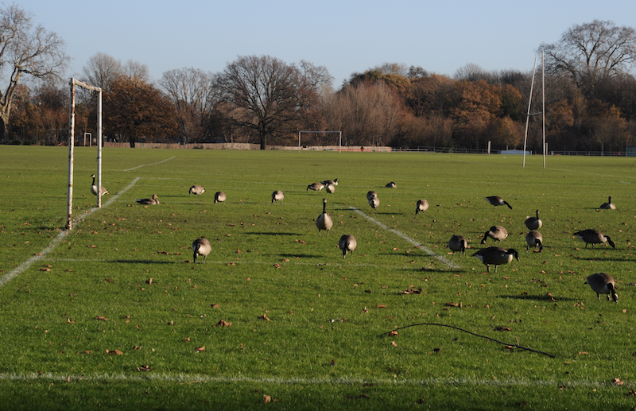
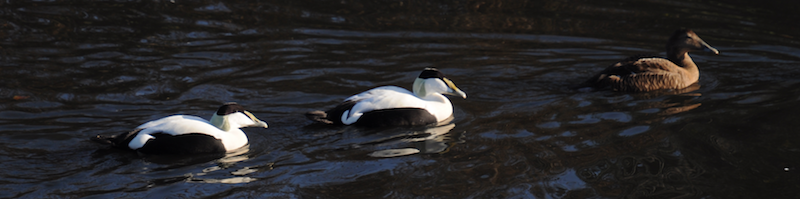
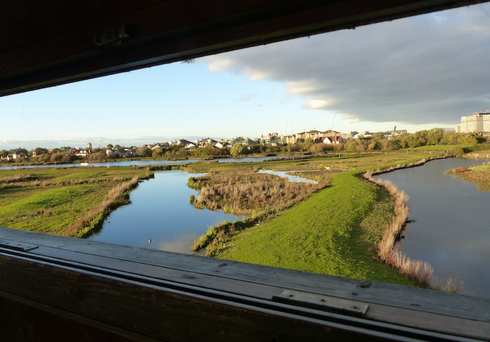

### Barnes WWT

A WWT reserve in TfL Zone 2. That can't possible work, can
it? Surprisingly, it can.

---
### Getting there

Public transport options are pretty good - either get National Rail to
Barnes and then a short bus trip (or ten minute walk) or tube to
Hammersmith and grab a bus (slightly longer, walk probably less
pointful) from there.

There is good access from the Thames path if you're on a bike coming
from the East.

<figure class="figure">
  
  <figcaption class="figure-caption text-center">
    These geese may greet you should you approach from the river
  </figcaption>
</figure>

If you're in the same quadrant of London as the reserve (i.e South
West) driving isn't totally insane and there is a sizeable car park.

---
### How to do it

If you prefer, this whole section is available
[as a custom google map](https://www.google.com/maps/d/viewer?mid=1hea4aGqt_3IZi8UkvRKxQV5i4JbYw_q_&ll=51.48163886851217%2C-0.2277705500000593&z=16)

Like all WWT reserves, Barnes is well marketed and well visited - be
prepared to share the reserve with a wide range of birding enthusiasm
levels, from serious scope spotters to occasional hordes of children
attempting but failing to be quiet (it's just too exciting).

One upside to Barnes' urban location is that it is _very_ well birded;
it seems to be blessed with some extremely patient folk, I suspect not
least because its two signature rarities (Bittern and Jack Snipe)
often require a bit of hard work to find.

Before you continue - open [the official
map](https://www.wwt.org.uk/wetland-centres/london/plan-your-visit/london-map/);
it has some names I'm going to rely on.

If you want any hope at all of piece and quiet and you're visiting on
a weekend, be at Barnes when it opens. Visit the sightings board in
the courtyard to catch up with the latest news, and have a quick look
out from the observatory's giant glass frontage - I've been lucky
enough to waltz straight on to a Bittern in there before.

#### A quick Bittern side note

I'm going to go out on a limb here and say that this is probably the
most reliable place in the UK to see Bittern in the Winter. The site
is small, well birded, well stocked (reports of up to five Bitterns on
a single day) and well reported, so if there is a Bittern:

  * Someone will spot it
  * It'll usually be reported (Check [WWT London Twitter](https://twitter.com/wwtlondon?lang=en))
  * You should be able to get to where it's been seen before it disappears

To maximise your chances of a decent view:

  * Time your visit to intersect with a cold, clear, dry, still day in winter
  * Keep an eye out for bittern news
  * Don't be ashamed of bailing half way across the reserve to get on it

Enough Bittern; let's go for an explore.

#### Part one: the North side - Headley and Wildside hides

Once you've convinced yourself the view from the observatory is free
of further interest (or the annoying lack of focus the windows cause
get the better of you), I would head out towards the Headley hide.

On the way, keep your eyes open; the hedgerow separating the
collection from the reserve proper often holds a Reed Bunting or a
Cetti's Warbler.

Headley should be a relatively quick stop, unless it's a freezing cold
day, in which case you may find it's warmth rather trickier to
leave. Scan the reedbed in front carefully; it could have Bittern or
Water Rail hiding within it, or a Cetti's Warbler (to the left of the
hide, usually) if Spring has sprung. I've seen Stock Dove and Green
Woodpecker meandering around on the grassy peninsula that extends from
the right side of the hide, so give that a strong examination as
well. Once you get bored enough to start looking at gulls, it's
probably time to move on.

Take whatever route you like to the Wildside hide. In Spring and
Summer you should have a pleasant accompaniment of warbler background;
in colder months, you might get something interesting amidst the tit
flocks.

<figure class="figure">
  
  <figcaption class="figure-caption text-center">
    On a miserable day, you may be thankful of the company of the eiders in the collection
  </figcaption>
</figure>

My experience of the Wildside hide varies wildly. In Autumn and
Winter, I mostly visit for completeness - there might be a Pintail or
two at the far end of the reservoir pond. Sometimes a vagrant (Ring
necked duck, or duck that must not be named) turns up here. More
likely there will not be very much at all; perhaps a goose or a gull
on the sad little mud island immediately in front of the hide.

In Spring and Summer, however, Wildside offers the best view of the two
grassy edges (and fencing) of the grazing marsh. Pipits (meadow,
water, some occasional claims of more exciting varieties), wagtails
(pied, grey and yellow), chats (stone and whin) and Wheatear should be
carefully looked for.

Head back to the centre when you're finished; strongly consider
whether you need coffee, a snack, or a use of the facilities; I
usually require at least one.

#### Part two: The East side

You should now be ready for the second half of the reserve. Both hides
on the way to Peacock Tower are worth a visit; each allow some tricky
part of the reedbed to be viewed; have a good check (take your time!)
if you're looking for Bittern, and don't forget the reeds nearest the
hide. If you get bored of staring at reeds, have a break and check the
edges of the islands you can see for waders; Snipe is likely, as is
Redshank.

If you reach Peacock Tower Bitternless, you're probably going to stay
that way unless you hang around 'til dusk and catch one in flight. The
Tower is much better for spying on the wader scrape and the grazing
marsh; if there are interesting waders on the sight they'll almost
certainly be found from the Tower.

<figure class="figure">
  
  <figcaption class="figure-caption text-center">
    Tower hide view (on a quiet day)
  </figcaption>
</figure>

While you wait for something of interest to turn up, or for one of the
professionals to find a Jack Snipe, two of the Tower's more fixed
offerings may be on show. First, have a good look at Charing Cross
Hospital; a pair of Peregrines nest on it, and frequently end up
sitting on the railings on the side visible from the
reserve. Secondly, in the warmer months, the Tower comes with Sand
Martins - there's an obvious bank where they nest of the right hand
side of the scrape.

In general, once I am tired of the Tower I am ready to go home - even
if on a super quiet day all of the above has taken ninety minutes. If,
at that point, it isn't freezing cold, consider taking the long way
back via the rear of the sheltered lagoon, it's a pleasant walk, and
often has plenty of littlies to keep one entertained; it's a good
place to find the year's first Chiffchaff or Willow Warbler in the
Spring, in addition.

---
## Eat / Drink / Stay

You're in London - the options are limitless

---
## Nearby

The Thames crossing at Hammersmith can occasionally have an
interesting gull or two. Barnes Common (you'll have gone through it if
you got the train to Barnes and then a bus) looks like it ought to be
alright, but the couple of occasions I've decided to walk through it
yielded so little that I haven't tried since.