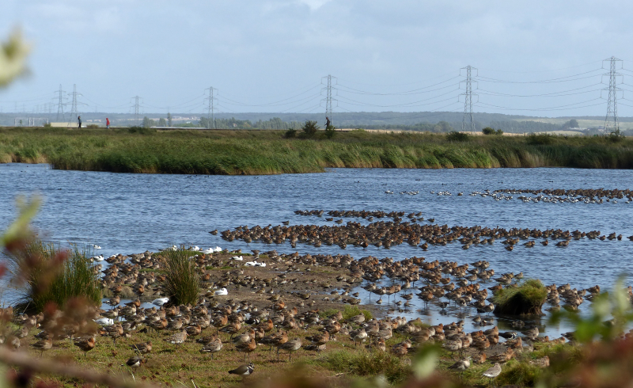
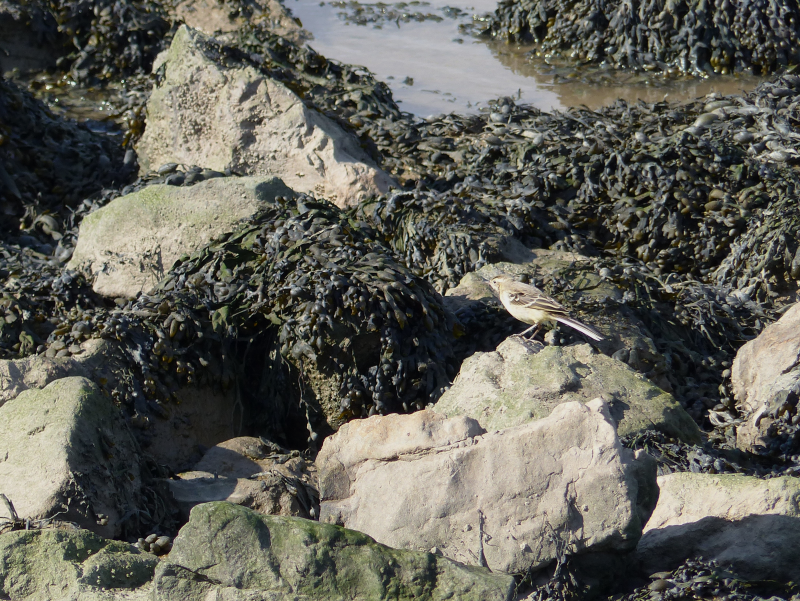

### Oare Marshes

Either Kent's worst or best kept secret, Oare has wader quality that
verges on Slimbridge levels, and a habit of producing some excellent
rarities, particularly during fall passage.

---
### Getting there

Nearby Faversham is well served by High speed Southeastern services if
approaching from London. The reserve is then:

* a good hour's walk (use the Saxon Shore Way)
* a twenty minute cycle
* a ten minute drive or taxi ride 
* a fifteen minute bus (hourly, not Sundays, [timetable](https://tiscon-maps-stagecoachbus.s3.amazonaws.com/Timetables/South%20East/Kent/3%20wef%20180917.pdf)) followed by a ten minute walk; fafftastic.

---
### Facilities

Are entirely absent, and there's not a lot of cover if you're aiming
for shifty wee behind a bush.

---
### How to do it

Before we start, here's [an annotated map version](https://www.google.com/maps/d/viewer?mid=1JRC277-AUIex8gll2OEfC0fcMFF04kOc&ll=51.343665150329166%2C0.892576149999968&z=16)
of this guide, for the more geographically inclined.

Like many wetland reserves, you should aim to time your arrival at
Oare with a rising tide - it will push more of the birds on to the
reserve, where they are easier to see.

I remember first going to Oare some years ago and being astonished by
both the number and the proximity of birds to the right of the road
through the reserve. There are a few places you can park on the road
which have superb views of the water (the "East Flood") and various
scrapes. Partake of them if you can. If they're full (likely on a weekend)
there's a capacious car park at the end of the road.

<figure class="figure">
  
  <figcaption class="figure-caption text-center">
    Love at first sight? There can't be too many reserves that greet you like this
  </figcaption>
</figure>

Cycle parking is restricted to whatever post/pole you can find to lock
up to - there's a handrail on some steps up to the sea wall that I've
used to this end a couple of times.

Once you're set - start by having a good old look at the main body of
the reserve from the road. A visit during fall passage should mean the
spit that extends into the water from the road is chock a block with
Golden Plover, Dunlin, Avocet, Black Tailed Godwit and Redshank. A bit
of searching should find a Ruff or two - check among the non-sleeping
Godwits to the left and right of the spit.

A bit of luck and some more intensive searching as the summer starts
to wane (late July to early September) might yield Spotted Redshank,
Little Stint and Curlew Sandpiper (I saw four or five of the latter in
August 2015 along with a summer plumage Knot; a very pleasant
surprise).

In terms of where to look - in addition to the obvious mud - keep an
eye on the edges of the East flood. Water Rail breed here and can be seen
even in the height of summer. The edge of the spit poking out into the
East flood is often a good place to find the tinier (read: scarcer)
wader species, as well as a thin sandbank/mudflat that runs parallel
to the road that sits almost in the centre of the East Flood.

<figure class="figure">
  
  <figcaption class="figure-caption text-center">
    Yellow Wagtail (juvenile) on the rocks next to the sea wall. I think. Hmm.
  </figcaption>
</figure>

Once you start to feel like you've seen everything from the road, head
towards the Swale to start the circular path around the reserve in a
clockwise direction. Along the sea wall, watch out for wagtails (of
all sorts). On the extensive mud, there should also be plenty of
Curlew around. During passage, inspect the curly-beaked inhabitants
closely; Whimbrel turn up here quite frequently. In recent years, a
returning Bonaparte's Gull has favoured this area, providing an
excellent opportunity to hone your Gull skills (hint: its head is _way_
more black than a Black-headed Gull).

The hide at the point is worth a brief visit (although you can just as
easily set up next to it) - Little Ringed and Ringed Plover often turn
up on the mud flats to the North of it in significant numbers. To the
East, Horse Sands may be worth a quick check for seals. Across the
water, the South shore of the Isle of Sheppey hosts Swale NNR; it's
worth scanning above the extensive reedbed for Marsh Harrier
(frequent) and Short Eared Owl (possible; I've not seen them though).

Heading inland from the hide, listen out for Bearded Reedling pinging
in the reedbed to your right. If you're very patient you might manage
to see one or two, mostly I just end up staring angrily at Reed
Buntings, though.

When you reach the sluice, it's worth having a look at the pylons
immediately South for Peregrine, and at the barges and various other
perch points in the creek for Kingfisher. Take a right (so, heading
West, back towards the road) after the sluice on to the final quarter
of the walk.

On this last section, you _might_ manage to find Bearded Reedling in
the reedbed on your left (I haven't, but not for lack of trying). Pay
a visit to the hide for completeness only; I'm not sure it offers any
views of the site not better viewed from the road or the sea wall, but
if you're the thorough sort, you might find a Snipe or two from it
that you mightn't spot from elsewhere.

Return to the road for one last look before heading off.

---
### Links

Kent Ornithological Society maintains a yearly sightings blog for this
site which is a _must read_ if you intend to visit. Here's the
[2018](https://kentos.org.uk/oare-marshes-2018/) and
[2017](https://kentos.org.uk/oare-marshes/) versions.

The page on [Birding for
all](http://www.birdingforall.com/england/kent/oare-marshes-reserve/)
illustrates the circular walk very well.

---
### Eat / Drink / Stay

Have unilaterally failed to eat at [The Three
Mariners](https://www.thethreemarinersoare.co.uk/) every time I've
been, due to lack of planning or lack of company. If you're anywhere
near a peak time, _book in advance_.

