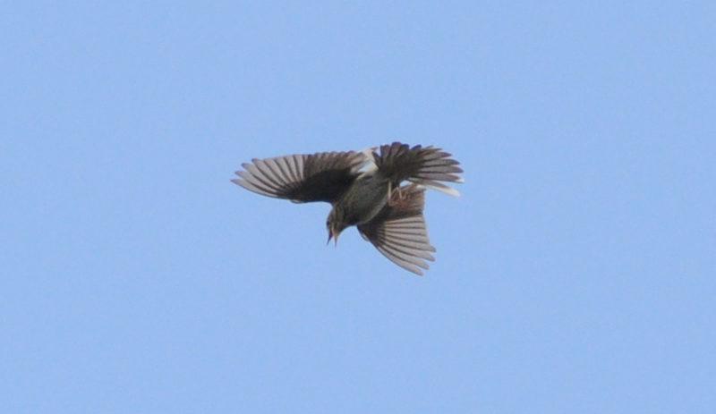

### Padley Gorge

A delightful walk in the woods which can have spectacular payoffs.

Padley gorge is a just that - a gorge, near Padley. At the base of the
gorge, Burbage Brook babbles, beautifully. 

An ancient Oak woodland covers the slopes of the gorge. At the top, the trees
spread out a bit before giving in to becoming prime Peak District moorland.
The woodland should, in Spring, provide some spectacular views of both
flycatchers (but particularly Pied), Common Redstart and Wood Warbler.

### Getting there

It's easiest to start at Grindleford station; trains from Manchester
Piccadilly and Sheffield twice hourly, ample car parking.

### Facilities

The café at the station has a donation based loo. Or you can buy something.
Good luck not buying chips.

### How to do it

Visit in May, before the trees are in full leaf, on a day when
the sun will be out.

From the café, cross the railway bridge _and_ the bridge over the
brook, then take the first right, up the hill. You should now be climbing a
nice looking single track road between some seriously nice looking houses. 
At the top, a gate with some National Trust signs around it signals the start of
the woodland.

After not more than five minutes walk you will come across the remains of
some stone structures. Turn left here, and keep walking until you've a stone
wall off to your right-hand side.

<figure class="figure">
  
  <figcaption class="figure-caption text-center">
    Keep this to your right.
  </figcaption>
</figure>

Stop here, and look carefully for numbered
nest boxes on tree trunks. They shouldn't be more than twenty feet off the 
ground; be patient, once you've found one, others will start to stick out.

Give your senses some time to adjust to the woods here. If the weather is
good, the air should be busy with the sound and movement of birds. Perhaps a
Nuthatch is determinedly drilling about - there usually is. It shouldn't be
too long before a Treecreeper hones into view either.

<iframe src='https://www.xeno-canto.org/34594/embed' scrolling='no' 
frameborder='0' width='340' height='220'></iframe>

 

A more unfamiliar call, or, perhaps, a rather energetic flit may give away this
walk's star bird - a Pied Flycatcher.

<figure class="figure">
  
  <figcaption class="figure-caption text-center">
    This is the sort of thing to look for.
  </figcaption>
</figure>

Another possible suspect for "I can't place that noise" may be Common Redstart.

<iframe src='https://www.xeno-canto.org/76760/embed' scrolling='no' 
frameborder='0' width='340' height='220'></iframe>

 

Just beyond the wall, the path splits three ways, with two strands continuing
up the hill, and one heading along the gorge to the right. Heading upwards
traverses some further woodland where we've had good Common Redstart views
, and been told Wood Warbler can be found (sadly not by us though). Our
 preferred route takes the path to the right. 

If you haven't found a Pied Flycatcher yet, slow down some more. This path
has nest boxes within a few feet of the path, and if you take your time,
eventually one of these handsome little creatures will elect to take a
perch you can admire them on. Probably near box 8.

<figure class="figure">
  
  <figcaption class="figure-caption text-center">
    It's hard not to anthopomorphise an angry stare from the male here.
  </figcaption>
</figure>

Shortly another path choice looms large, with one fork heading upwards and
another wending down towards the brook. If pushed, we'd probably recommend the
higher path - the woods are a little lighter, and resulting the views of
birds are less obscured. We had excellent luck just at the point
where the path crosses a wall at the top of the climb, with a really active
pair of Pied Flycatchers flitting about, with a Spotty jumping around too.

<figure class="figure">
  
  <figcaption class="figure-caption text-center">
    A shy Female Pied Flycatcher.
  </figcaption>
</figure>

The moorlands at the top may have a displaying Tree Pipit, and (towards the
beginning of May) we'd bet you'd find Cuckoo as well. There are options to
mount a serious extension to this walk here via Owler Tor, a digression we'll
not take advantage of here. Instead, we'll bear right, back down towards the
brook.

<figure class="figure">
  
  <figcaption class="figure-caption text-center">
    Tree Pipit displaying. Pew pew pew!
  </figcaption>
</figure>

We don't get long in the woods on this path - it's perhaps only a couple of
hundred metres before the trees start to thin again, with the Oak giving way
to Silver Birch. I feel convinced this area should be better for Redstart and
Wood Warbler, but have had little luck with either species - on previous
visits, we sat on the rocks at the edge of the wood, and a further Pied
Flycatcher was hopping around again.

One can at this point either return on the same side of the gorge for more of
the same, or cross the bridge at the top for an ice cream and then follow the
path on that side back down to Grindleford. Alternatively one can again
choose a lengthier walk; Burbage Rocks has breeding Ring Ouzel if you're up
for the challenge of trying to spot one. We'll assume that, like us, you're
now hungry for chips, but also like a circular walk.  

This opposite side of the gorge tends to be much quieter for our star species
- having seen 10+ Pied Flycatchers on the way out we've seen none at all on
the way back. There is a strong possibility of
picking up a Dipper, _despite_ the levels of disturbance down in the brook
proper. Pay particular attention to the two tiny cascades that head down from
the road into the brook. Not least because the path across them can be a bit
of a challenge!

<figure class="figure">
  
  <figcaption class="figure-caption text-center">
    A terrible map of the walk
  </figcaption>
</figure>

[Full size version](Padley_Gorge-walk-fullsize.png)

<ul>
    <li>A: The cafe. Blessed be its chips.</li>
    <li>B: The ruin. Keep it to your right.</li>
    <li>C: Box 8 is near here. Slow down and look.</li>
    <li>D: Look for an ice-cream van here</li>
</ul>

Map tiles courtesy of [OpenStreetMap](https://www.openstreetmap.org/).

### Links

The [Eastern Moors partnership](https://www.visit-eastern-moors.org.uk/) lists
some absolutely cracking walks in the nearby moorland.

### Eat/drink/stay

The Grindleford Café, next to the station, does hearty food (excellent
chip butties) in generous portions. It's cash only, mind. In nearby
Froggatt, [the Chequers Inn](https://www.chequers-froggatt.com/) is highly
recommended; don't have the prawn cocktail starter, though.