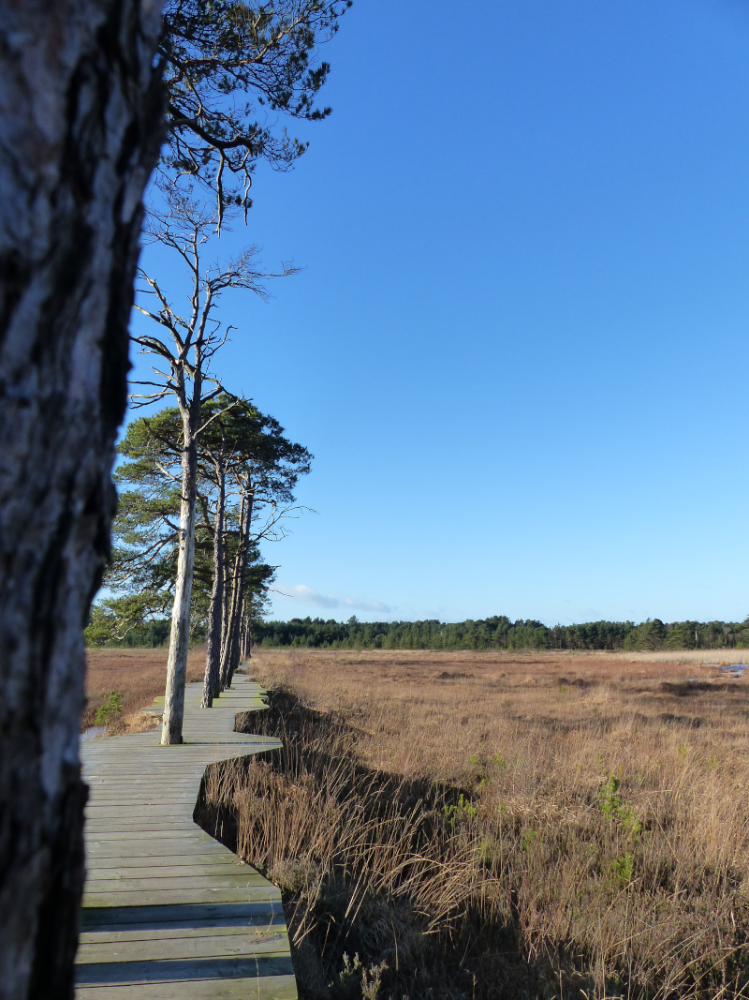
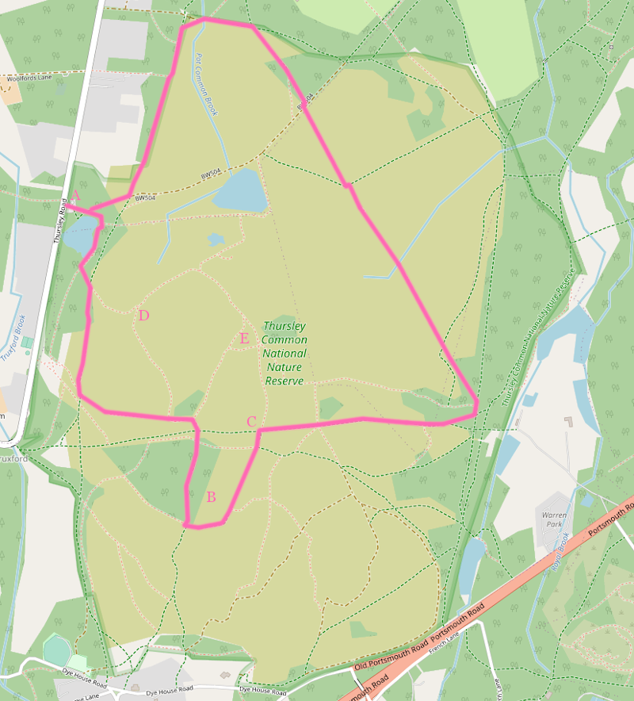
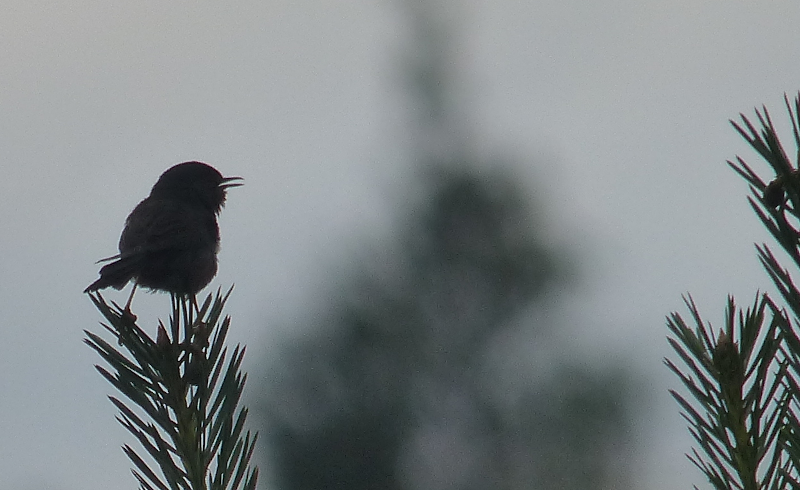
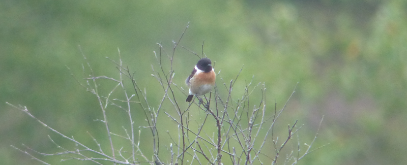

### Thursley Common

Occasional shrike haven in the A3 corridor also offers one of the better
opportunities to catch up with otherwise hard to find heathland birds, as
 well as some seasonal specialties such as Nightjar.

### Getting there

Can be a struggle. Milford is the nearest station, but then getting to
the common without being mown down trying to cross the A3 is rather
trickier. I have managed to cycle to the Moat car park successfully at
least once in the past; using a car might be the most sensible way to
get here, to be frank.

### Facilities

Absent. There was once a tremendous boardwalk, but a fire in 2020 destroyed it.

<figure class="figure">
  
  <figcaption class="figure-caption text-center">
    The beautiful boardwalk, now extinct :-(
  </figcaption>
</figure>

### How to do it

Thursley is good all year round, but to catch up with its most
crepuscular claim to fame you'll need to visit between May and
August. For once, a leisurely post-lunch start might be best in these
circumstances, unless you have the stamina for a dawn until dusk
birding session.

If you do make it here during the Summertime and aim to connect with Thursley's
 more twilight visitors, bring a torch! If you're outside that season,
fear not, Thursley may still grant you the gift of a wintering shrike, or, 
failing that, a fleeting view of a Dartford Warbler or two.

In both cases, more patience than you might think is going
to be required. Thursley is a mix of coniferous woodland,
heathland, and other mixed woodland, none of which will give up their
secrets easily. Be prepared to see very little and to be satisfied with the
amazing scenery, and then if something does turn up, so much the better.

That said, our trips here have given us some useful knowledge of where to go
that we can now share.
 
We suggest starting at the Moat car park - we think it's possible to park in
Thursley village but we've not tried it. From there, there's a circuit that
should take in most of the hotspots.

In the car park, there's a map with the footpaths on it. Take a picture of it. 
There's a PDF of it somewhere online, but every time I link to it, it
disappears within three months. I also, somehow, manage to lose the pictures
 I take of it every time.

Here's a map of the way of one possible walk that we're going to _roughly_
 follow.
 
<figure class="figure">
  
  <figcaption class="figure-caption text-center">
    A terrible map of the walk
  </figcaption>
</figure>

[Full size version](Thursley_Common-walk-full.png)

<ul>
    <li>A: The Moat car park.</li>
    <li>B: Parish field.</li>
    <li>C: Nightjar crossroads.</li>
    <li>D: Dragonfly sculpture.</li>
    <li>E: Shrike hill.</li>
</ul>
  
Head East out of the car park, and then immediately South - you can either
choose a path that ferrets through the woodland, or one that traces the
border of the woodland and the heath. Both are fine choices. Keep an ear out
for the subtle call of Dartford Warbler in the sparse, younger trees - you
might be surprised at how easily you find one.

<figure class="figure">
  
  <figcaption class="figure-caption text-center">
    Be warned, this might be the best you can do.
  </figcaption>
</figure>

If you've taken the border path, you'll be greeted with several signs
dissuading you from investigating the burned boardwalks. We suggest
obedience. Hopefully one day the boardwalk will return, for it was
stupendous.

After ten or so minutes of walking you'll start to be given options to break
left. Take one that veers off at around 10 o'clock - it'll gently turn
Eastward. A pair of Stonechat will likely greet you here and accompany you
 along the path, just to make sure you aren't intending to raid their nest.

<figure class="figure">
  
  <figcaption class="figure-caption text-center">
    Hi!
  </figcaption>
</figure> 

This path will shortly approach a little copse - give it a close examination,
as it could hold Redstart or Flycatcher. Here there are multiple path options.
It may still be possible to visit the Dragonfly sculpture by taking a sharp
left before reaching this copse - be aware this will be a dead end though.
The other options are a gentler left, following the border of the copse, or
a right turn towards further woodland and a bridleway.

The gentle left will lead you towards a lump known as Shrike Hill. As far as
our experience goes it is not well named, but our visits have perhaps not always
been timed to coincide with shrike availability. It does provide an excellent
view over the rest of the reserve - if one wanted to have a sit down for a
sandwich and a survey, we can think of worse places to do so.

Taking the path right yields yet more choices. One can continue South, crossing
the bridleway and climbing into the woodland. This path, if you follow its
left turns anticlockwise, skirts around a grassy area known as Parish Field.
This is the home of Colin the Cuckoo - perhaps the UK's most photographed
bird. The mealworms left for Colin also tend to attract other good birds
 - Common Redstart and Woodlark are also often seen in this field too.

The path around Parish Field eventually returns you to the original bridleway
at yet another path crossroads. Note this location carefully - you'll want
to be able to get back to it later, for this is an excellent place to look
for Nightjar. More on that later.
 
Here we can either head straight on (the lack of boardwalk will enforce a
loop back to the previous copse via Shrike Hill, but there is good semi
-open heath that might yield Dartford on the way), or continue East.
The options for a short loop unfortunately went up in smoke in 2020. 

The longer, Eastern loop offers two different possibilities - the
key is to keep turning left. The longest route skirts through coniferous
woodland and should yield decent flocks of the usual suspects. Crossbills
are a possibility, apparently, albeit, from our experience, a slim one.
Alternatively if you prefer being in the sun, there are paths that short-cut
through heathier areas - these might well yield further Dartford Warbler or
Woodlark.

The goal, whichever path you choose, is to hook up with the North/South
bridleway that will take us back to the car park. The telegraph wires
 following it are worth a look - my bird book tells me Woodlark like them; 
Stonechat seem keen as well. Return to the Moat car park, either for
 refreshments of your own choosing, or a short drive to [The Donkey](http://donkeytilford.co.uk/).
 
If you've got your ducks lined up nicely, you'll be ready for part two of
your Thursley excursion around an hour before sundown. Follow the path, as
previously described, to the bridleway crossroads of destiny. Walk East up
the sandy bridleway until you have a reasonably panoramic view of your
surroundings. And now...wait. Wait until it gets dark. And listen...

N.B. We suspect there are other good spots as well, but this is where I saw my
 first one [in 2018](/features/a-200-bird-year/part-32-an-epic-day-out.html
 ), and I've been lucky here twice since, so...

Perhaps it's half an hour until sunset and you've not heard anything, and you're
wondering if this is all a ruse. This is not darkness! You have not
waited long enough! Ignore the inexplicably loud dance music coming from the
Western edge of the common (who is doing that? Honestly)! If you are seriously
struggling for patience, the trees at the bottom of the hill to the West 
are often treated as perch points by our quarry, so take some time out to
scan them.

Eventually though, you _will_ start to hear things. Perhaps it will be the
 unearthly chur of a Nightjar...
 

  <iframe src='https://www.xeno-canto.org/564415/embed' scrolling='no' 
 frameborder='0' width='340' height='220'></iframe>

Or it's weird-as-hell flight call, or wing-clapping:

  <iframe src='https://www.xeno-canto.org/657661/embed' scrolling='no' 
 frameborder='0' width='340' height='220'></iframe>

 
Just as likely though, it'll be the unplaceable cheeping of Woodcock - here
 the challenge is to audio-locate the in-flight bird!
 

  <iframe src='https://www.xeno-canto.org/662557/embed' scrolling='no' 
 frameborder='0' width='340' height='220'></iframe>

If you can hear Nightjar, your best bet of seeing the bird is to catch it in
flight, ideally silhouetted against a not completely dark sky. Perhaps it
might then take a seat somewhere you can have a proper look at it. A warm
moonlit evening is best, but we've managed to find them on two tepid grey
evenings too.

After a lot of hearing and no seeing, it may be worth walking the circuitous
path around to Shrike Hill - there are isolated Pine trees in that area that
are perfect Nightjar perch posts - look for a lump on a horizontal branch.

Finally, head back to the car park in triumph. We hope.

### Links

A few Colin links:

* [Black Audi Birding](http://blackaudibirding.blogspot.com/2020/06/colin-and
-friends-5th-june-2020.html)
* [All Things Wildlife](https://allthingswildlife.co.uk/articles/wild-things/92-photographing-colin-the-cuckoo-at-thursley-common)
* [Wanstead Birder](http://www.wansteadbirder.com/2021/04/roll-up-roll-up.html)

[A picture of the map](https://commons.wikimedia.org/wiki/File
:Notice_on_Thursley_NNR_near_The_Moat_-_geograph.org.uk_-_1802315.jpg) - I
 guarantee this link will be dead within six months of me posting it.
 
[A pdf with the map in it](http://publications.naturalengland.org.uk/file
/4906826886807552) - also guaranteed to immediately explode.

[Surrey Birders](https://surreybirdclub.org.uk/) maintain two excellent site guides to nearby [Chobham
](https://surreybirdclub.org.uk/sites-sightings/chobham-common-walks/) and
 [Hankley](https://surreybirdclub.org.uk/sites-sightings/hankley-common-walk
 /) Commons.
 
Finally, here an excellent [YouTube video](https://www.youtube.com
/watch?v=-6QCOape1KU) of two folks looking for Nightjar at Thursley (spoilers
: they do extremely well). In small world news, I think Eugene may have been
 on the same trip as me in 2018!

### Eat/drink/stay

As mentioned previously, [The Donkey](http://donkeytilford.co.uk/) - imagine
the best pub experience possible in the late 1990s, and then port it,
unchanged, into the present day.

A nearby craft brewery run by some ex-IT folks is also very much worth a
 visit: [https://www.craftbrews.uk/](https://www.craftbrews.uk/).

Finally, there's a handily placed Premier Inn in Farnham if, like us, the
idea of driving home after a Nightjar search is too much like hard work.
More luxurious/expensive/local hostelries are available from your search
engine of choice.